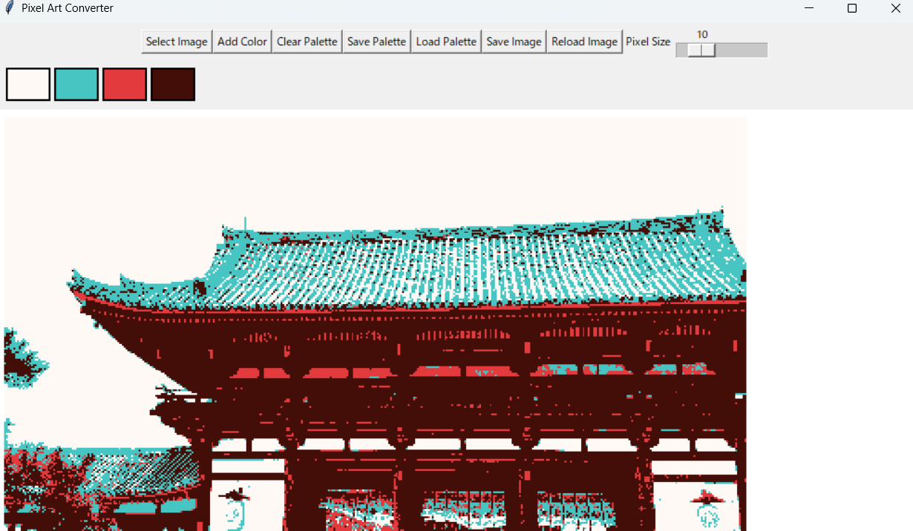
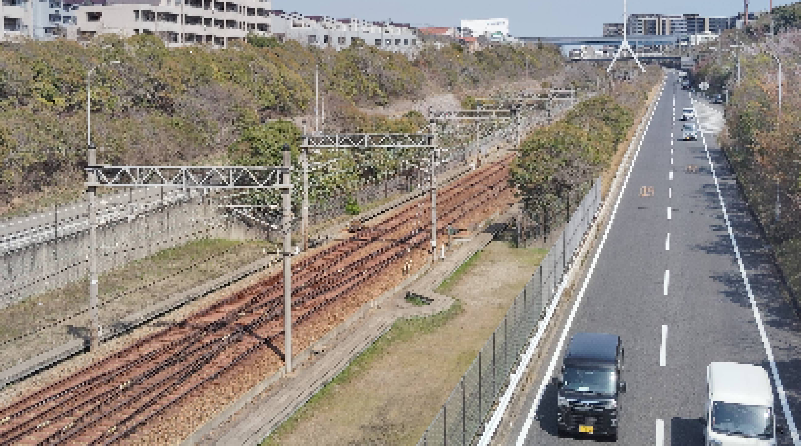
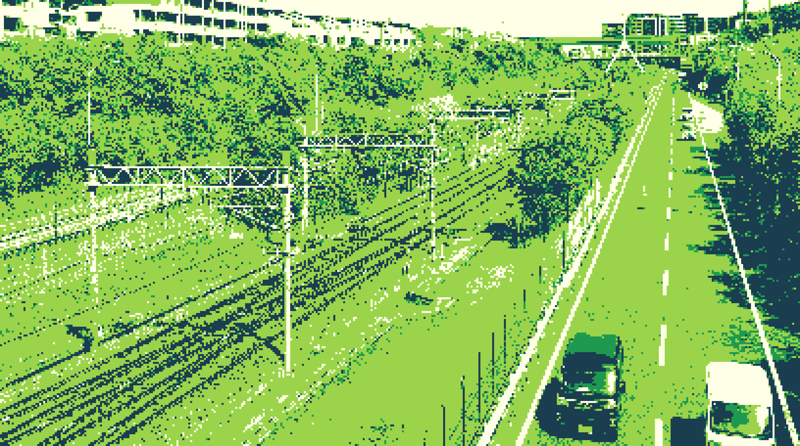

# PIXELER
Photo to pixel art converter



---

## Functions

- Load and pixelate an image
- Add or remove colors in the palette (click to remove)
- Save and load color palettes (in JSON format)
- Adjustable pixel size via slider (5 to 30)
- Reload original image
- Save the converted image (PNG / JPG / BMP)

---

## Sample images





---

## Clone & Run

```bash
git clone https://github.com/yourname/pixel-art-converter.git
cd pixel-art-converter
pip install -r requirements.txt
python pixeler.py